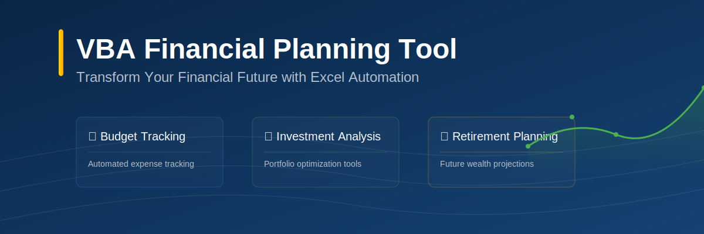
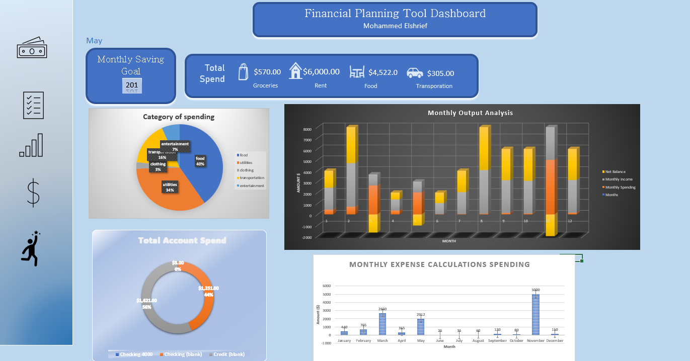

# MO's Comprehensive Financial Planning Tool



## 📊 Overview
A comprehensive Excel-based financial planning tool powered by VBA that helps users manage their personal finances, create budgets, track investments, and plan for retirement.

### Key Features
- 💰 Budget tracking and expense categorization
- 📈 Investment portfolio management
- 🎯 Retirement planning calculator
- 📅 Bill payment scheduler
- 📊 Dynamic financial dashboards
- 📝 Custom reporting system

# 🖥️ Demo

## Dashboard Preview



## 🚀 Getting Started

### Prerequisites
- Microsoft Excel 2016 or later
- VBA enabled in Excel
- Windows OS (recommended for full functionality)

### Installation
1. Download the latest release
2. Open the Excel file (.xlsm)
3. Enable macros when prompted
4. Navigate to the "Setup" worksheet
5. Follow the initialization wizard

## 📝 Usage Guide

### Initial Setup
```vba
' Initialize the financial planning workbook
Sub InitializeWorkbook()
    ' Setup necessary worksheets
    Call CreateRequiredSheets
    ' Initialize default categories
    Call SetupDefaultCategories
    ' Create dashboard
    Call CreateDashboard
End Sub
```

### Adding New Transactions
```vba
' Add new financial transaction
Sub AddTransaction()
    ' Transaction entry form
    With UserForm1
        .Show
        If Not .Cancelled Then
            ' Process transaction
            ProcessNewEntry .Amount, .Category, .Date, .Description
        End If
    End With
End Sub
```

## 🛠️ Technical Details

### Architecture
The tool is built using a modular approach with these key components:
- Data Management Module
- Calculation Engines
- User Interface Forms
- Reporting System
- Dashboard Generator

### Code Structure
```
📁 VBA Complete/
├── 📄 FinancialPlanningTool.xlsm
```

## 📊 Features in Detail

### Budget Management
- Automatic expense categorization
- Monthly budget tracking
- Variance analysis
- Custom category creation

### Investment Tracking
- Portfolio performance monitoring
- Asset allocation visualization

## 🎨 Customization

### Adding Custom Categories
```vba
' Add new expense category
Sub AddCustomCategory(categoryName As String, budgetLimit As Double)
    ' Validate inputs
    If Len(categoryName) = 0 Then Exit Sub
    If budgetLimit < 0 Then Exit Sub
    
    ' Add to categories list
    With ThisWorkbook.Sheets("Categories")
        .Cells(.Rows.Count, 1).End(xlUp).Offset(1, 0).Value = categoryName
        .Cells(.Rows.Count, 2).End(xlUp).Offset(1, 0).Value = budgetLimit
    End With
End Sub
```

## 📈 Performance Optimizations

### Best Practices
- Optimized worksheet formulas
- Efficient VBA coding patterns
- Memory management techniques

## 🤝 Contributing
Contributions are welcome!

## 📄 License
This project is licensed under the MIT License - see the [LICENSE](LICENSE) file for details.

## 🙏 Acknowledgments
- Financial formulas adapted from MSE100

---
Made with ❤️ by Xem0
